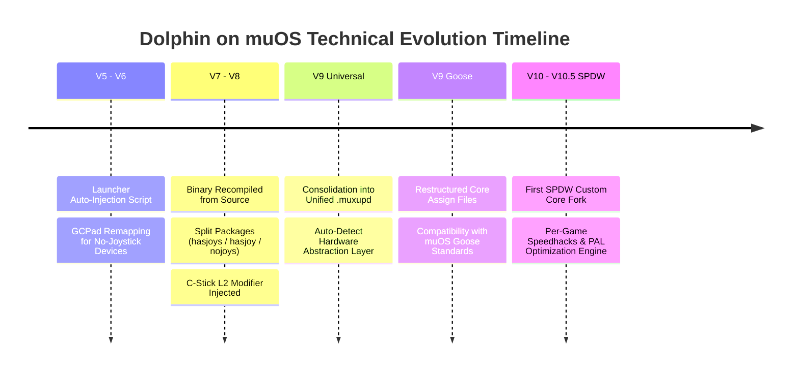

#  Dolphin <i>(pre)</i>Rt:Core &bull; **🏛️ History & Core Archive**
 

  

  
  
  
  

> ### 🏛️ *Welcome to the <u>digital fossil record</u>.*
> This directory houses all early iterations, test builds, experimental packages, and control profiles of the **Dolphin Core** (**Nintendo GameCube** & **Nintendo Wii**) compiled for **muOS** *before* the **Dolphin Rt:Core Triptych** ecosystem was formally established.
>
> These legacy artifacts trace the origin story of low-level ARM64 recompiler experimentation on the **Allwinner H700 SoC** ($4\times \text{Cortex-A53} \text{ @ } 1.5\text{ GHz}$), initiated by **[@Speedrun](https://community.muos.dev/u/speedrun)** and supported by early community pioneers.

---

## 📌 1. OVERVIEW & SYSTEM COMPATIBILITY

This repository section serves as a technical and historical archive documenting the step-by-step evolution of standalone Dolphin emulation under **muOS**.

* **🎯 Target Hardware:** Handhelds powered by the **Allwinner H700** chipset running **muOS** (Pixie, Goose, Jacaranda standards) featuring 0, 1, or 2 analog joysticks:
  * 🕹️ **Dual-Joystick Devices:** Anbernic **RG35XX H**, **RG40XX H**, **RG CubeXX**.
  * 🕹️️ **Single-Joystick Devices:** Anbernic **RG35XX SP**.
  * 🕹️ **Zero-Joystick Devices:** Anbernic **RG35XX Plus**.
* **⚠️ Incompatible Hardware:** <u>**Anbernic RG28XX is explicitly unsupported**</u> due to display resolution ($640\times 480$ vs ultra-small panel limits), strict memory limitations ($1\text{ GB}$ shared LPDDR4), and missing hardware inputs.

---

## 💬 2. ORIGINAL COMMUNITY ANNOUNCEMENT & ARCHIVE RECORD

Below is the preserved announcement from the **MustardOS Community Forum ([Topic #491](https://community.muos.dev/t/core-dolphin-for-muos-v9-take-3-by-speedrun/491))**, capturing the exact historical context when the Dolphin core was first brought to the handheld community.

<b>🔍 Click here to expand Original Forum Announcement & Screenshots</b>

 

  

 

> **Original Post Narrative by [@Magnaderra](https://community.muos.dev/u/magnaderra) (preserves [@Speedrun](https://community.muos.dev/u/speedrun)'s work):**
> 
> *"Hi everyone, this is a project to port the **Dolphin emulator**, the core for emulating the _Nintendo GameCube_ and _Nintendo Wii_.  
> Its author - dear **[@Speedrun](https://community.muos.dev/u/speedrun)** [+.[].%] - has done his best and is leaving it to <u>posterity</u>.  
> 
> You can download it here (Google Drive) and here (Mega). Game compatibility list is available.  
> <u>**RG28XX is not supported**</u>.  
> Huge thanks to **[@FireBattleInMtl](https://community.muos.dev/u/firebattleinmtl)** for all changes after V8.  
> 
> **Changes in V5–V8:**  
> * Fixed file execution permissions thanks to **[@FireBattleInMtl](https://community.muos.dev/u/firebattleinmtl)** & **[@Snow](https://community.muos.dev/u/snow)**.  
> * Updated Dolphin binary compiled directly from source by **[@Snow](https://community.muos.dev/u/snow)**.  
> * Custom `gcpadnew.ini` profiles introduced for zero-joystick and single-joystick handhelds.  
> * Automated `launch.sh` auto-injection script created by **[@FireBattleInMtl](https://community.muos.dev/u/firebattleinmtl)**.  
> * V8 split package system (`hasjoys`, `hasjoy`, `nojoys`).  
> * V9 unified all profiles into a single universal auto-detecting core payload.  
> 
> **[UPD]** Now compatible with Goose! You can get adopted version here. Thanks to **[@bitter_bizarro](https://community.muos.dev/u/bitter_bizarro)**!"*

---

## 📂 3. HISTORICAL RELEASE INDEX & FILE INVENTORY

All archived packages preserved in this historical directory are cataloged below:

| Version | Package File | Format | Target Architecture & Milestone Notes |
| :--- | :--- | :---: | :--- |
| **v7** | `Dolphin for muOS V7-hasjoys.zip` | *Zip Archive* | Early build tailored for <u>dual-joystick</u> handhelds. |
| **v7** | `Dolphin for muOS V7-nojoys.zip` | *Zip Archive* | Tailored for devices <u>lacking physical analog joysticks</u>. |
| **v8** | `Dolphin for muOS V8-hasjoy.zip` | *Zip Archive* | First build introducing <u>single-joystick</u> (`hasjoy`) bindings. |
| **v8** | `Dolphin for muOS V8-hasjoys.zip` | *Zip Archive* | Dual-joystick release with **freshly recompiled binary**. |
| **v8** | `Dolphin for muOS V8-nojoys.zip` | *Zip Archive* | Refined layout for <u>joystick-free hardware</u>. |
| **v9 (Take 1)** | `Dolphin for muOS V9-take1.muxupd` | **.muxupd Package** | Initial attempt at a <u>universal hardware consolidation</u> payload. |
| **v9 (Take 2)** | `Dolphin for muOS V9-take2.muxupd` | **.muxupd Package** | Iterative update fixing permission bugs and launcher script hooks. |
| **v9 (Take 3)** | `Dolphin for muOS V9-take3.muxupd` | **.muxupd Package** | <u>**Historical Benchmark Release**</u> by **[@Speedrun](https://community.muos.dev/u/speedrun)** unifying all hardware classes. |
| **v9 (Goose)** | `Dolphin for muOS V9-Goose.muxupd` | **.muxupd Package** | Adapted by **[@bitter_bizarro](https://community.muos.dev/u/bitter_bizarro)** for <u>**muOS Goose**</u> file standards. |
| **v10 [SPDW]** | `Dolphin for muOS v10_SPDW.muxupd` | **.muxupd Package** | First custom fork release by **[@SilverCrow2323](https://github.com/SilverCrow2323)** introducing initial speedhacks. |
| **v10.5 [SPDW]** | `Dolphin_for_MuOS_v10.5.124_SPDW.muxupd` | **.muxupd Package** | Pre-Rt:Core release testing <u>per-game engine overrides</u> and PAL $50\text{ Hz}$ targets. |

---

## 📜 4. TECHNICAL EVOLUTION & DETAILED CHANGELOG

### 👥 Key Contributors & Pioneer Directory

| Pioneer Contributor | Community Role & Engineering Contributions |
| :--- | :--- |
| **[@Speedrun](https://community.muos.dev/u/speedrun)** | **Lead Core Developer** & Creator of the original port, low-level JIT tweaks, and the V9 universal architecture. |
| **[@Magnaderra](https://community.muos.dev/u/magnaderra)** | Community chronicler who published and documented the original release thread on MustardOS forums. |
| **[@FireBattleInMtl](https://community.muos.dev/u/firebattleinmtl)** | Shell developer who engineered the `launch.sh` auto-injection pipeline and fixed post-V8 Linux execution permissions. |
| **[@Snow](https://community.muos.dev/u/snow)** | Systems compiler who recompiled the core Dolphin binary directly from source for ARM64 optimizations. |
| **[@bitter_bizarro](https://community.muos.dev/u/bitter_bizarro)** | System maintainer who updated assign structures and launcher syntax for **muOS Goose** compliance. |
| **[@SilverCrow2323](https://github.com/SilverCrow2323)** | Author of the **SPDW Custom Core Fork** (V10 / V10.5) and creator of the **Rt:Core Triptych**. |

---

### 🚀 Chronological Technical Evolution

---

#### 🟢 **[V5 – V6] Early Experiments & System Integration**
* **V5 Release Features:**
  * **System Integration:** Embedded an automated installation script to inject Dolphin execution hooks directly into muOS's `/opt/muos/script/launch.sh` pipeline *(Authored by **[@FireBattleInMtl](https://community.muos.dev/u/firebattleinmtl)**)*.
  * **Permissions Hardening:** Fixed non-executable file attributes (`chmod +x`) on Dolphin binaries and wrapper scripts *(Authored by **[@FireBattleInMtl](https://community.muos.dev/u/firebattleinmtl)** & **[@Snow](https://community.muos.dev/u/snow)**)*.
* **V6 Release Features:**
  * **Control Remapping (`gcpadnew.ini`):** Resolved fundamental input barriers on devices *lacking physical analog joysticks* (e.g., RG35XX Plus):
    * `D-Pad` defaults to directing the **Main Analog Stick**.
    * `L2 + D-Pad Direction` triggers native **GameCube D-Pad** inputs.

---

#### 🟡 **[V7 – V8] Hardware Split & Virtual C-Stick Era**
* **V7 Release Features:**
  * **Split Build System:** Divided installer packages into hardware-specific archives (`hasjoys` for dual-joystick devices vs `nojoys` for zero-joystick devices).
* **V8 Release Features:**
  * **Source Recompilation:** Updated core binary using a **fresh ARM64 build compiled from source**, delivering noticeable frame-time stabilization *(Authored by **[@Snow](https://community.muos.dev/u/snow)**)*.
  * **Single-Joystick Support:** Introduced the `hasjoy` configuration variant for single-analog devices like the **RG35XX SP**.
  * **C-Stick Virtualization (`gcpadnew.ini`):** Implemented modifier hotkeys (`L2 + A/B/X/Y`) to simulate **GameCube C-Stick** axis movements on hardware lacking a second analog stick.

---

#### 🔴 **[V9 – V10] Universal Unification, Firmware Adapters & SPDW Forks**
* **V9 Universal Milestone (Take 1 – Take 3):**
  * **Hardware Consolidation:** Merged `hasjoys`, `hasjoy`, and `nojoys` variants into a **single, universal `.muxupd` package**.
  * **Hardware Fallback Model:** Internal device hardware determines profile initialization. Connecting an external dual-analog controller to a single-stick handheld preserves internal binding priorities.
* **V9 Goose Adapter:**
  * Package structure refactored by **[@bitter_bizarro](https://community.muos.dev/u/bitter_bizarro)** to comply with updated core assignment standards on **muOS Goose** firmware.
* **V10 & V10.5 SPDW Custom Core Iterations:**
  * `v10_SPDW`: Initial custom fork by **[@SilverCrow2323](https://github.com/SilverCrow2323)**, introducing underclock tweaks ($\text{CPU clock} = 0.50\times$) and custom graphics hacks.
  * `v10.5.124_SPDW`: Advanced pre-release testing targeted game-specific overrides (e.g., *Super Mario Strikers*, *Luigi's Mansion*) and established the $50\text{ Hz}$ PAL regional standard.

---

## 🎮 5. CONTROL SHORTCUTS & HOTKEYS (`gcpadnew.ini`)

> [!WARNING]
> **Historical Hotkey Legacy Note:** Early V5–V9 releases documented a safe exit combo (`L1 + L2 + R1 + R2 + Power`). On newer muOS releases (Goose / Jacaranda), this combination is obsolete. Use the hardware reset shortcuts or update to **Flavour I: Comfort Zone** for native <kbd>START</kbd> + <kbd>SELECT</kbd> exit handling.

| Execution Command | Button Combination | Scope & Context |
| :--- | :--- | :--- |
| **Legacy Safe Exit Combo** | `L1` + `L2` + `R1` + `R2` + **Hold Power (2s)** | *V5–V9 legacy combo (Deprecated on modern muOS firmware).* |
| **muOS Safe Reboot** | `L2` + `R2` + `START` | *Hardware reboot shortcut.* |
| **muOS Safe Shutdown** | `L2` + `R2` + `SELECT` | *Hardware power-off shortcut.* |
| **Main Analog Emulation** | `D-Pad` | Native binding on **zero-joystick handhelds** (V6+). |
| **Native D-Pad Trigger** | `L2` + `D-Pad Direction` | Direct D-Pad input override for **zero-joystick devices** (V6+). |
| **Virtual C-Stick Direct** | `L2` + `A` / `B` / `X` / `Y` | Virtual C-Stick deflection on **single/zero-joystick devices** (V8+). |

---

## 🔗 6. SOURCES, REFERENCES & COMMUNITY ARCHIVES

* 💬 **MustardOS Discussion Thread:** [[Core] Dolphin for MuOS V9 Take 3 by @Speedrun (Topic #491)](https://community.muos.dev/t/core-dolphin-for-muos-v9-take-3-by-speedrun/491)
* 📊 **Community Test Matrix:** [Google Sheets Legacy GameCube/Wii Compatibility Sheet](https://docs.google.com/spreadsheets/u/0/d/1LHXQV78yAuvii8J77KUgEt3Ap6TagjQzN48gdB9iVKY/htmlview)
* ☁️️ **Community Cloud Mirrors:**
  * Legacy mirror packages preserved on [Google Drive Archive Mirror](https://drive.google.com/drive/folders/1oIdjzDEuOw0CfErXUgp5cKmyypjnrjoJ?usp=sharing).
  * Legacy mirror packages preserved on [MEGA Archive Mirror](https://mega.nz/folder/OtViWDyR#9FMAES423bckWKd3Rwsjdw).

---

  
  
    
  <b>Dolphin Core for muOS — Historical Archive Record</b> 
  <b><u>Honoring the Pioneers. Preserving the Code.</u></b> 🎮

