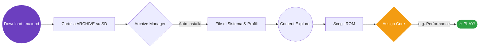
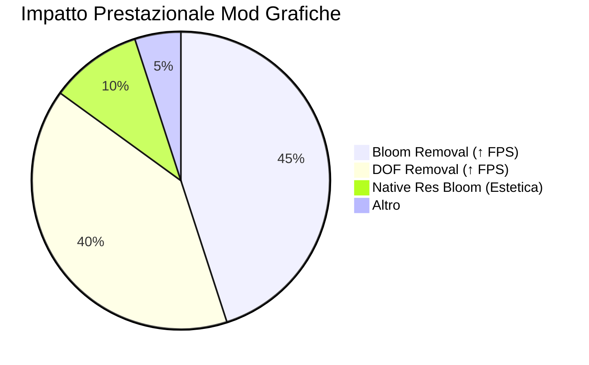

#     Flavour 1: 'Comfort Zone'

 

> [!IMPORTANT]
> ### 📥 [SCARICA L'ULTIMA RELEASE (.muxupd)](https://github.com/SilverCrow2323/Dolphin-Core-for-MuOS/releases/latest) 📥

---

 
  ### ⚡ TL;DR — Dritto al punto
  ***Only straight gaming sessions, no setting nightmares.*** ✨
  
  **Comfort Zone** is the *streamlined* edition of Dolphin Rt:Core. 
  Abbiamo incluso 7 profili preimpostati per le massime prestazioni, un'intera libreria di **Graphics Mods** già preconfigurata per i titoli più pesanti, e una gestione nativa: premi **START + SELECT** (hotkey di sistema muOS) e l'emulatore si chiuderà all'istante in modo pulito.
  
   

---

## 📖 Overview

  
  
  **Comfort Zone** fornisce un emulatore Dolphin **completamente configurato** per ***muOS***, integrato direttamente all'interno del **Content Explorer**.
  
  🗂️ Assegna semplicemente un core alla tua cartella delle ROM **GameCube** o **Wii** (o ai singoli giochi), scegli il titolo e... gioca! 
  
  * ❌ Nessun tool aggiuntivo richiesto.
  * ❌ Nessun menù complesso da navigare.
  * ❌ Nessuno script esterno da avviare.
  
  Tutto funziona attraverso il *normale flusso di avvio* del tuo dispositivo.
   

---

## 🆕 What's New in v11.5.00

| Change | Icon | Description |
| :--- | :---: | :--- |
| **JITARM64 forzato** | ⚙️ | `CPUCore = 4` in tutti i profili — fino a **3-5× più veloce** |
| **Shader asincroni** | 🎬 | `ShaderCompilationMode = 3` per eliminare lo *stuttering* da compilazione |
| **Libreria Mod Grafiche** | 🎨 | Tutte le mod grafiche ufficiali Dolphin preinstallate |
| **GameSettings dedicati**| 🎯 | Overrides mirati per i giochi più pesanti o problematici |
| **Niente più Python** | 🔥 | Controller nativo SDL: latenza minima, zero overhead |
| **Low-noise logging** | 📝 | `Verbosity=1` e nessuna scrittura su file: protegge la tua SD |
| **Chiusura pulita** | 🐛 | Handler SIGTERM perfetto tramite START+SELECT |

---

## 🚀 Flusso di Installazione e Utilizzo

Per rendere l'idea di quanto sia semplice il processo, ecco lo schema visivo del funzionamento interno dal download al gameplay:

*Schema 1 — Da zero al gameplay in pochi passaggi.*

### Step per l'installazione manuale:
1. Scarica il file `Dolphin_RtCore_v11.5.00_ComfortZone.muxupd`.
2. Copialo nella cartella **ARCHIVE** (`/opt/mmc/ARCHIVE/` su SD1 o `/sdcard/ARCHIVE/` su SD2).
3. Apri le **Applications** e lancia l'**Archive Manager** 📦.
4. Seleziona il file e attendi la fine: mod, file, settings e core si installeranno da soli.

> [!TIP]
> **Come assegnare i core?** Apri il Content Explorer, vai sulla tua cartella GameCube/Wii, premi **X**, seleziona **Assign Core** e scegli la cartella Nintendo. Appariranno 7 profili pronti all'uso!

---

## ⚙️ Profili — La tua cassetta degli attrezzi

Non sai quale profilo scegliere? Consulta questa tabella di riferimento rapido:

| Profilo | Scopo Principale | Consigliato per... |
| --- | --- | --- |
| 🚀 **performance** | Il *daily driver*. Bilanciato e veloce. | 🔵 Il 90% del gaming quotidiano |
| 🛡️ **compatibility** | Precisione massima, ma più lento. | 🟠 Titoli con difetti grafici evidenti |
| 💨 **rintromping** | Velocità pura, settaggi aggressivi. | 🟢 Titoli leggeri o per spremere frame |
| ⚡ **speedhacks** | Hack di velocità aggiuntivi. | 🟡 Quando ti serve un piccolo boost extra |
| 🖥️ **blackscreenfix** | Risolve il problema dello schermo nero. | 🔴 Giochi che non si avviano (black screen) |
| 🎯 **sweetspot** | Profilo vuoto per le tue personalizzazioni. | ⭐ Il tuo tuning personale |
| 🏠 **default** | Vanilla Dolphin, nessun tuning. | 🔧 Debug o punto di ripristino |

*(Nota: Ogni profilo è disponibile nelle varianti **Upright** ⬆️ e **Sideways** ↔️ dove applicabile).*

---

## 📦 Formati supportati e Raccomandazioni

  
  
  I formati nativi supportati sono: `ISO` · `GCM` · `RVZ` · `WBFS`.
    
  
  ### 🏆 Il formato Reale: **RVZ**
  
  L'***RVZ*** è la scelta assoluta per i dispositivi portatili con muOS. Garantisce il bilanciamento perfetto tra risparmio di spazio e fluidità.
  
  * **Algoritmo ideale:** *Zstandard (zstd)*. Viene decompresso dalla CPU quasi istantaneamente, azzerando gli scatti (*stuttering*) durante il caricamento delle texture.
  * **Da evitare:** `LZMA`. Più compresso, ma asfissia la CPU.
  * **Livello consigliato:** `5` (sweet spot tra spazio e tempo di conversione).
   

> [!WARNING]
> Il formato RVZ non aumenta gli FPS massimi di per sé, ma **elimina la latenza di lettura** del disco rispetto a file ISO molto frammentati. Usalo sempre!

---

## 🎨 Graphics Mods — Modding integrato

Dolphin Rt:Core include **60+ mod grafiche ufficiali**, più configurazioni mirate scritte dal qui presente Sir Pips con il consueto supporto di [R.I] Minoru. 

mettiamo che bloom removal di base è attivato per tutti i titoli
### Le Custom Mods pre-installate per i titoli "Heavy":
Ogni cartella gioco (es. `Load/GraphicMods/<Game Title>/`) possiede queste varianti disattivate di default:
* `Bloom Native Resolution`
* `DOF Removal` *(Altamente consigliato per recuperare prestazioni)*
* `DOF Native Resolution`
* `HUD Removal`

**Titoli coperti da mod dedicate:** *Crash (Nitro Kart, Tag Team, Wrath of Cortex), DBZ Budokai (1 & 2), Super Mario Sunshine, Scaler, Metroid Prime, Smash Bros Melee, Mario Smash Football.*

> [!NOTE]
> **Come attivarle/disattivarle?** Le mod sono controllate dalla presenza di un file `.disabled`. Cancellalo tramite il file manager di muOS (o via terminale/SSH con `rm <percorso>/.disabled`) per attivare la mod!

---

## 🛡️ Database di Compatibilità

Non sai quali settaggi usare per un gioco specifico? La community ti aiuta:

### 🔗 **[Esplora la Compatibility List](https://silvercrow2323.github.io/Dolphin-Core-for-MuOS/)**

Oltre 200 titoli testati con indicazioni su:
- ⭐ Rating di giocabilità
- 📊 Framerate medio atteso
- 🎯 Il profilo *Assign Core* raccomandato
- 🔧 Soluzioni a problemi noti

---

## 🙏 Credits

  <table>
    <tr>
      <td align="center">
         
        <strong>sirpips</strong> <small>(SilverCrow2323)</small>
      </td>
      <td valign="middle">
        <ul>
          <li>🏭 <strong>SPDW Factory Lab:</strong> Integrazione muOS, packaging, configurazioni e Mod.</li>
          <li>🐬 <strong>Dolphin Emulator:</strong> Il software di emulazione core.</li>
          <li>🎛️ <strong>Team muOS:</strong> Per lo straordinario OS e framework.</li>
          <li>🎨 <strong>Dolphin Community:</strong> Per le librerie grafiche ufficiali.</li>
        </ul>
      </td>
    </tr>
  </table>

 

  
  
    
  <em>Dolphin Rt:Core for muOS — Flavour 1: Comfort Zone.</em> 
  <strong><u>Still Sbrobbing. Always Rintromping.</u></strong> 🎮

