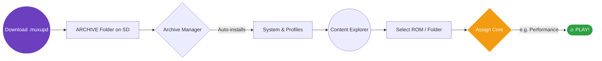
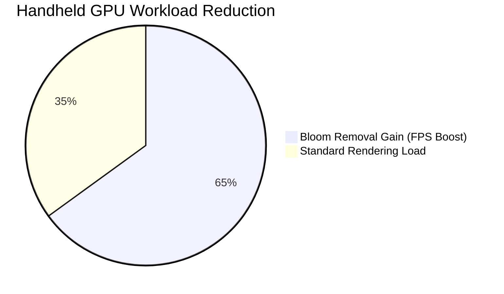

  
   
  
  
  # Flavour 1: 'Comfort Zone'
  
  **Conceived in v11.0.00. Brutally perfected in v11.5.00.**

  [-6c3fbf?style=for-the-badge&logo=github)](https://github.com/SilverCrow2323/Dolphin-Core-for-MuOS/releases/latest)
  
  

---

  

  ### ⚡ TL;DR — Straight to the Point
  ***Only straight gaming sessions. No setting nightmares.*** ✨

  **Comfort Zone** is the streamlined, definitive edition of Dolphin Rt:Core. If you hate tweaking menus and just want to play, this is your release. 
  
  We have engineered **7 preset profiles** tuned for maximum performance and native hardware management. Forget complex hotkeys or external scripts: everything runs through your device's standard launch flow. When you are done playing, simply press **START + SELECT** (the native muOS hotkey), and the emulator shuts down instantly and cleanly.

   

---

## 🆕 The v11.5.00 Standard

We didn't just update Dolphin; we rebuilt the integration specifically for muOS hardware. Here is why v11.5.00 is the definitive way to play:

| Feature | Icon | Technical Impact |
| :--- | :---: | :--- |
| **Forced JITARM64** | ⚙️ | `CPUCore = 4` locked across all profiles. Expect up to **3-5× faster** raw emulation. |
| **Async Shaders** | 🎬 | `ShaderCompilationMode = 3` absolutely eliminates texture compilation stuttering. |
| **Targeted GameSettings**| 🎯 | Silent, pre-configured overrides for the most demanding titles (no action required). |
| **Python Exiled** | 🔥 | The Python watcher is dead. Pure native SDL pad implementation means **minimum latency, zero overhead**. |
| **Low-Noise Logging** | 📝 | `Verbosity=1` with zero file writing. Your SD card lifespan is preserved. |
| **Clean Shutdown** | 🐛 | A flawless SIGTERM handler triggered natively via START+SELECT. |

---

## 🚀 Workflow & Installation

We designed the pipeline to be frictionless. From download to gameplay, the system handles the heavy lifting.

*Chart 1 — Zero to gameplay in seconds.*

### Installation Steps:
1. **Download** the `Dolphin_RtCore_v11.5.00_ComfortZone.muxupd` package from the [Releases](https://github.com/SilverCrow2323/Dolphin-Core-for-MuOS/releases/latest) page.
2. **Move it** to the `ARCHIVE` folder (`/opt/mmc/ARCHIVE/` on SD1 or `/sdcard/ARCHIVE/` on SD2).
3. Open **Applications** on your device and launch the **Archive Manager** 📦.
4. Select the file. The system will automatically inject all system files, settings, and cores.

> [!TIP]
> **Assigning Cores is easy:** Open the Content Explorer, hover over your GameCube/Wii folder (or a single game), press **X**, select **Assign Core**, and choose the Nintendo folder. The 7 ready-to-use profiles will be waiting for you.

---

## ⚙️ The Toolkit: 7 Preset Profiles

Pick your poison. Every profile is available in both **Upright** ⬆️ and **Sideways** ↔️ variants (where applicable).

| Profile | Main Purpose | Best Used For... |
| --- | --- | --- |
| 🚀 **performance** | The Daily Driver. Fast, balanced, reliable. | 🔵 **90%** of your everyday gaming. |
| 🛡️ **compatibility** | Accuracy-first rendering. Slightly heavier. | 🟠 Titles showing obvious visual glitches. |
| 💨 **rintromping** | Pure speed. Aggressive, unsafe settings. | 🟢 Squeezing frames out of heavy games. |
| ⚡ **speedhacks** | The Performance profile + extra engine hacks. | 🟡 When you just need that tiny boost. |
| 🖥️ **blackscreenfix** | Specific boot fixes applied. | 🔴 Games that refuse to start (black screen). |
| 🎯 **sweetspot** | The blank canvas. | ⭐ Your personal, custom tuning playground. |
| 🏠 **default** | Vanilla Dolphin. Zero SPDW tuning. | 🔧 Debugging or restoring baseline performance. |

---

## 📦 The Royal Format: RVZ

  
  
  While `ISO`, `GCM`, and `WBFS` are natively supported, **RVZ** is the absolute king for muOS handheld devices. It strikes the perfect mathematical balance between storage savings and runtime fluidity.
  
  * **The God-Tier Algorithm:** *Zstandard (zstd)*. The CPU decompresses it almost instantaneously, entirely bypassing the micro-stutters caused by heavy texture loading.
  * **Avoid at all costs:** `LZMA`. It shrinks files aggressively but chokes mobile CPUs to death.
  * **The Sweet Spot:** Level `5`. Pushing compression higher yields diminishing returns and wastes hours of conversion time.
   

> [!WARNING]
> RVZ does *not* magically increase your peak FPS. However, it **eliminates disk read latency** compared to fragmented ISOs. If you want a smooth experience, convert your library to RVZ.

---

## 🎨 Graphics Mods: Global Optimization

For **Flavour 1 (Comfort Zone)**, the objective is "plug-and-play stability." We are keeping things lean to maximize your framerates without requiring you to manually toggle settings.

### Active by Default:
* 🌍 **Global Bloom Removal:** We have forced this active across *all* games. Removing Bloom frees up massive GPU resources, immediately maximizing your FPS and keeping device thermals significantly lower.

> [!NOTE]
> **Looking for the full Mod Arsenal?**
> Targeted HUD removals, advanced Depth of Field (DOF) adjustments, and Native Resolution tweaks are too volatile for a "Comfort Zone" release. The complete, unlocked modding suite will be fully deployed in the upcoming alternative release: ***Flavour 2***.

---

## 🛡️ Compatibility Database

Stop guessing. The community has already done the benchmark testing for you.

### 🔗 **[Explore the Official Compatibility List](https://silvercrow2323.github.io/Dolphin-Core-for-MuOS/)**

Consult our database of over 200+ tested titles to find:
* ⭐ 1-5 Star Playability Ratings.
* 📊 Expected average framerates.
* 🎯 The exact *Assign Core* profile you should use.
* 🔧 Required workarounds for known engine issues.

---

## 🙏 Credits

  <table style="border-collapse: collapse; border: none;">
    <tr style="border: none;">
      <td align="center" style="border: none; padding-right: 30px;">
         
        <strong>Sir Pips</strong> 
        (SilverCrow2323)
      </td>
      <td valign="middle" style="border: none;">
        <ul style="list-style-type: none; padding-left: 0;">
          <li style="margin-bottom: 10px;">🏭 <strong>SPDW Factory Lab / Sir Pips:</strong> Conception, muOS integration, aggressive packaging, and custom configurations.</li>
          <li style="margin-bottom: 10px;">🤖 <strong>[R.I] Minoru:</strong> Crucial technical assistance and low-level code support.</li>
          <li style="margin-bottom: 10px;">🐬 <strong>Dolphin Emulator Team:</strong> The incredible core emulation engine.</li>
          <li>🎛️ <strong>muOS Team:</strong> For providing the ultimate OS and launch framework.</li>
        </ul>
      </td>
    </tr>
  </table>

 

  
  
    
  <em>Dolphin Rt:Core for muOS — Flavour 1: Comfort Zone</em> 
  <strong><u>Still Sbrobbing. Always Rintromping.</u></strong> 🎮

