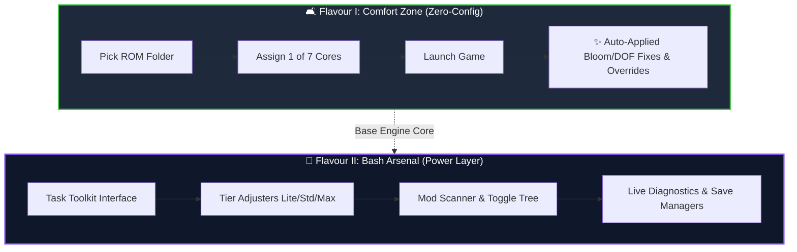
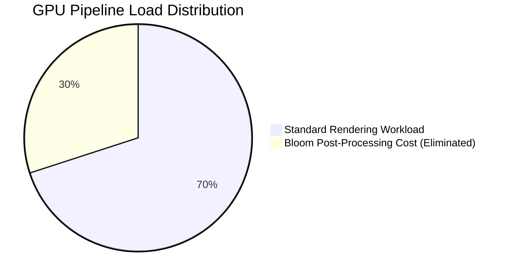

  
  
  <h1>🐬 Flavour I: <u>Comfort Zone</u></h1>
  <h3><i>Dolphin Rt:Core set and ready for muOS</i></h3>
  

    
    
    
    
  

> ### ⚡ **TL;DR — <u>Straight to the Point</u>**
> ***Only straight gaming sessions, zero setting nightmares.*** 🎮
>
> **Comfort Zone** is the **<u>no-configuration, zero-friction flavour</u>** of Dolphin Rt:Core. It ships with **7 battle-tested profile presets**, **automatic global bloom removal**, **curated per-game engine overrides**, and a **bundled HD texture pack for Crash Nitro Kart**. Assign the core, boot your ROM, and play.

 

---

## 📖 <u>The Edition — What Comfort Zone Is</u>

  
  

  **Comfort Zone** is engineered for players who want to **<u>launch games and get out of the way</u>**. Every internal setting — *from JIT compilation flags and shader render pipelines to gamepad mapping and graphics post-processing* — has been **pre-tuned and locked to optimal values**.

 

### 🎯 <u>Comfort Zone vs. Power User Flavour</u>

* 🚀 **<u>Zero Setup Required</u>** — *No menus to open, no INI files to tweak, no manual scripts to trigger.*
* 🛠️ **<u>Integrated Hotkey Shutdown</u>** — *Pressing <kbd>START</kbd> + <kbd>SELECT</kbd> closes Dolphin natively and cleanly.*
* 🔒 **<u>Stable Baseline</u>** — *Guarantees pristine, uncorrupted configurations on every boot.*

> [!TIP]
> If you want granular control over individual engine parameters, tier scaling, and live mod toggles, upgrade to **Flavour II: Bash Arsenal**. Comfort Zone is designed as the **<u>bulletproof daily driver</u>**.

---

## ⚙️ <u>The Seven Profiles — Engine Tuning</u>

  

  Every profile in Comfort Zone forces **JITARM64** (`CPUCore = 4`) and **Async Shader Compilation** (`ShaderCompilationMode = 3`). On Allwinner H700 hardware, this combination delivers an immediate framerate boost of $\Delta_{\text{FPS}} \approx +50\% \text{ to } +300\%$ over standard interpreter modes.

 

| Profile Name | Engine Philosophy | Primary Target Use Case |
| :--- | :--- | :--- |
| 🚀 **`Performance`** | **<u>Balanced Daily Driver</u>** — *moderate engine hacks* | **90%** of your everyday GameCube/Wii library |
| 🛡️ **`Compatibility`** | **<u>Accuracy First</u>** — *minimal hacks, strict logic* | Games experiencing visual artifacts or physics bugs |
| 💨 **`Rintromping`** | **<u>Maximum Speed</u>** — *aggressive CPU underclocking* | Lightweight titles or games needing maximum frame output |
| ⚡ **`Speed Hacks`** | **<u>Hacked Rendering</u>** — *unsafe EFB/XFB bypasses* | Heavy 3D titles suffering from heavy GPU slowdown |
| 🖥️ **`Black Screen Fix`** | **<u>GPU Synchronization</u>** — *forced sync flags* | Problematic titles that freeze on boot or show a black screen |
| 🎯 **`Sweet Spot`** | **<u>Custom Neutral</u>** — *balanced baseline* | Hand-tuned middle ground for user experimentation |
| ⛩️ **`Default`** | **<u>Vanilla Reference</u>** — *unmodified Dolphin defaults* | Benchmark reference and fall-back diagnostic testing |

> All 7 profiles are available for **GameCube** (*upright*) and **Wii** (*upright* and *sideways* gamepad orientation).

---

## 🌸 <u>Automatic Bloom Removal — Global GPU Gain</u>

Post-processing **bloom blur** is the single largest GPU bottleneck on the Allwinner H700 chipset. 

Comfort Zone forces **<u>Global Bloom Removal</u>** across the entire emulator engine out of the box:

* **<u>How It Works</u>** — *Strips full-screen blur render passes applied after initial frame generation.*
* **<u>Measured Impact</u>** — *Delivers **+2 to +5 net FPS** gain across demanding 3D titles while significantly reducing handheld thermal throttling.*
* **<u>User Configuration</u>** — *None. Fully active globally on first boot.*

---

## 🏎️ <u>Crash Nitro Kart — HD Texture Pack Included</u>

  

  A curated **HD Texture Pack** for *Crash Nitro Kart* is pre-installed directly inside the package (`Load/Textures/`).

 

* **<u>Artifact Resolution</u>** — *Fixes the notorious **C4 texture tiling corruption** affecting HUD buttons, UI menus, and character icons across all GameCube regions (`GCN`, `GCNE7D`, `GCNP7D`).*
* **<u>Visual Clarity</u>** — *Replaces low-resolution UI elements with sharp HD vector assets.*
* **<u>Footprint</u>** — *Compact **5.7 MB** footprint ensures zero RAM strain on H700 hardware.*
* **<u>Status</u>** — ✅ **<u>Active by default</u>** *(Dolphin matches and applies textures automatically via GameID).*

---

## 🎯 <u>Curated Per-Game Tweaks — Targeted DOF Removal</u>

  

  Ten heavy 3D titles ship with **<u>targeted Depth-of-Field (DOF) removal mods</u>** automatically active. Disabling depth blur removes heavy screen-space shader calculations on titles that push the hardware to its absolute limit:

 

| Game Title | Engine & Graphics Tweaks Applied |
| :--- | :--- |
| 🏎️ **Crash Nitro Kart** | **DOF Removal** + **Bundled HD Texture Pack** |
| 🏎️ **Crash Tag Team Racing** | **DOF Removal** |
| 🌪️ **Crash Bandicoot: Wrath of Cortex** | **DOF Removal** + **XFB Engine Override** |
| 🐉 **Dragon Ball Z: Budokai 1 & 2** | **DOF Removal** + **XFB Engine Override** |
| 🍄 **Super Mario Sunshine** | **DOF Removal** + **EFB Access Override** |
| 🎯 **Scaler** | **DOF Removal** + **CPU Underclock 0.40** |
| 🛸 **Metroid Prime** | **DOF Removal** |
| 🥊 **Super Smash Bros. Melee** | **DOF Removal** |
| ⚽ **Mario Smash Football** | **DOF Removal** + **CPU Underclock 0.40** |

---

## 🎛️ <u>Empiric GameSettings — 12 Hand-Tuned Overrides</u>

  

  Comfort Zone includes **twelve hand-tuned `GameSettings` overrides** built from real-world testing. These per-game INI overrides tune internal CPU clock ratios and memory access modes:

 

| GameID | Game Title | Applied Engine Override Rationale |
| :---: | :--- | :--- |
| `G4QE01` | Super Mario Strikers | **Underclock 0.40** *(prevents audio stuttering)* |
| `GKUE01` | Scaler | **Underclock 0.40** *(stabilizes CPU pacing)* |
| `GLMP01` | Luigi's Mansion | **Underclock 0.40** *(smooths out mansion exploration)* |
| `GMSP01` / `GMSE01` | Super Mario Sunshine | **EFB Access + Underclock 0.60** *(fixes goo rendering)* |
| `GDBP69` / `GDBE69` | DBZ Budokai 1 | **XFB Fix + Underclock 0.60** *(eliminates flickering)* |
| `GZ3P69` / `GZ3E69` | DBZ Budokai 2 | **XFB Fix + Underclock 0.55** *(stabilizes combat FPS)* |
| `GCBP7D` / `GCBE7D` | Crash: Wrath of Cortex | **XFB Fix + Underclock 0.50** *(eliminates loading blackouts)* |
| `GOWP69` | Need for Speed: Most Wanted | **Underclock 0.50** *(forces playable racing frame-rate)* |

---

## 🚪 <u>Native Exit Hotkey — START + SELECT</u>

Terminating Dolphin in Comfort Zone is instantaneous:

$$\text{Press } \langle \mathbf{START} \rangle + \langle \mathbf{SELECT} \rangle \longrightarrow \text{Send } \texttt{SIGTERM} \longrightarrow \text{Return to muOS}$$

* ⚡ **<u>Native Event Watching</u>** — *Background watcher reads controller input natively through SDL.*
* 🧹 **<u>Clean Process Termination</u>** — *Sends standard `SIGTERM` directly to Dolphin, ensuring memory cards and save files close cleanly without corruption.*
* 🚫 **<u>Zero Extra Menus</u>** — *No confirmation dialogs or key combinations to memorize.*

---

## ⚠️ <u>Technical Boundaries & Hardware Reality</u>

> [!IMPORTANT]
> **<u>Allwinner H700 Performance Context:</u>**
> The Allwinner H700 processor sits at the baseline entry limit for GameCube and Wii emulation. Comfort Zone squeezes maximum performance out of the chipset, but hardware boundaries remain:
>
> * 🟢 **Lightweight 2D & 3D Games:** `30 – 50 FPS` *(Playable)*
> * 🟡 **Medium 3D Games:** `15 – 25 FPS` *(Fair)*
> * 🔴 **Heavy 3D Games:** `5 – 15 FPS` *(Technical Benchmark)*

* ⚠️ **<u>GameCube System Fonts Required:</u>** Titles such as *NFS: Most Wanted* require system BIOS fonts (`Sys/GC/font_western.bin` and `Sys/GC/font_japanese.bin`) to avoid booting into a black screen.
* 📝 **<u>SD Card Protection:</u>** Log output is strictly capped at **2 managed files total** (`launcher_report.log` and `watcher.log`), preventing excessive disk writes.

---

## 🔗 <u>Reference & Compatibility</u>

For benchmark reports covering over **200+ tested GameCube and Wii games** (including star ratings, expected FPS ranges, and recommended core profile assignments), visit the official database:

🌐 **[Dolphin Rt:Core for muOS - Compatibility List](https://silvercrow2323.github.io/Dolphin-Core-for-MuOS/)**

---

## 🙏 <u>Credits & Acknowledgments</u>

  
   
  <b>sirpips aka SilverCrow2323</b>
   
  <i>SPDW Factory Lab</i>

 

| Contributor / Project | Key Contribution |
| :--- | :--- |
| 🐬 **Dolphin Emulator Team** | Core emulation software engine and graphics backend |
| 🏭 **SPDW Factory Lab / sirpips** | Comfort Zone architecture, profile tuning, GameSettings overrides, package deployment |
| 💾 **muOS Development Team** | Operating system architecture, launch script wrapper, system integration |
| 👥 **Dolphin Community** | Graphic mods, texture fix references, community benchmarking |

---

  
  
    
  <b>Dolphin Rt:Core v11.5.00 — Flavour I: Comfort Zone</b> 
  <b><u>Still Sbrobbing. Always Rintromping.</u></b> 🎮

