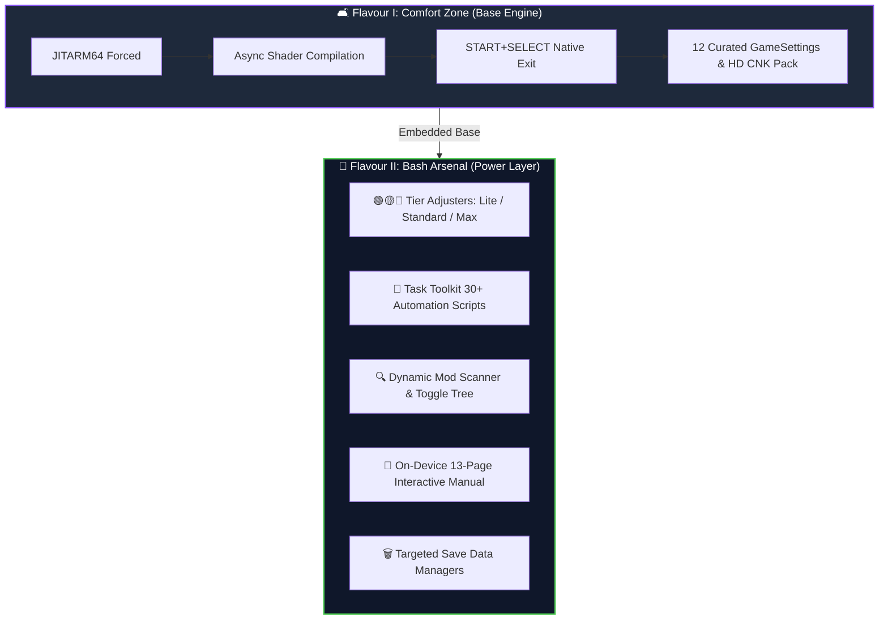
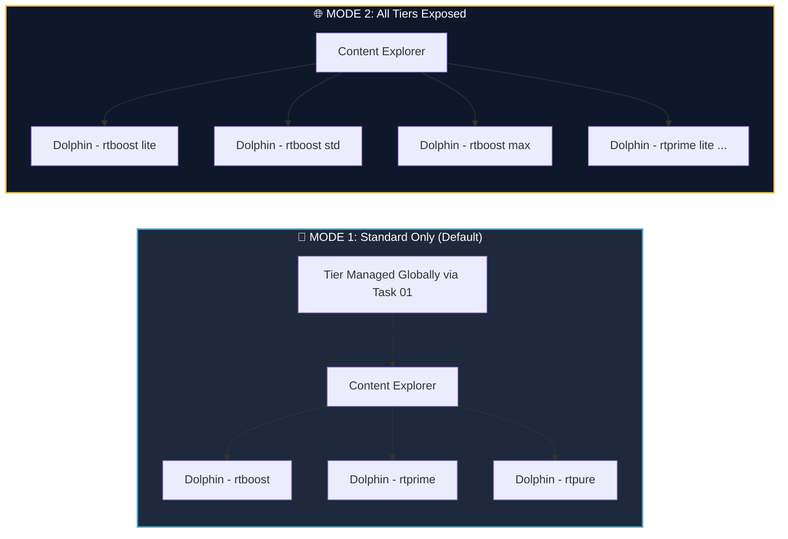

<div align="center">
  
  
  <h1>🐬 Flavour II: <u>Bash Arsenal</u></h1>
  <h3><i>Dolphin Rt:Core Power-User Extension for muOS</i></h3>

  <p>
    <a href="https://github.com/SilverCrow2323/Dolphin-Core-for-MuOS/releases/latest">
      
    </a>
    
    
    
  </p>
</div>

---

> ### ⚡ **TL;DR — <u>Full Control. Zero Hand-Holding.</u>**
> ***If Comfort Zone is "plug and play," Bash Arsenal is "plug, play, and tweak every knob."*** 🔧
>
> **Bash Arsenal** is the **<u>power-user extension layer</u>** built directly on top of *Comfort Zone (Flavour I)*. Everything from Flavour I is preserved **100% intact** — plus you gain **<u>tier adjusters</u>**, **<u>task automation</u>**, **<u>live graphics mod scanning</u>**, **<u>safe save managers</u>**, and an **<u>in-toolkit technical manual</u>**.

---

## 📖 <u>Overview & Philosophy</u>

<div>
  
  

  **Bash Arsenal** transforms Dolphin Rt:Core into a modular power-tool. It exposes a **<u>full Task Toolkit interface</u>** natively inside muOS, granting direct control over **profile engine intensity**, **graphics mod toggles**, **save data wiping**, and **system diagnostics** — *without ever leaving the handheld interface or editing raw text files*.
</div>

<br clear="all">

### 💡 <u>Why Bash Arsenal is a Superset (Not a Replacement)</u>



* **<u>100% Comfort Zone Compatibility</u>** — *every base profile, optimization, and hotkey remains fully operational.*
* **<u>Tiered Profile Scaling</u>** — *switch any profile between 🟢 **Lite**, 🟡 **Standard**, and 🔴 **Max** intensity.*
* **<u>30+ Task Automation Scripts</u>** — *organized into 7 clean menu categories.*
* **<u>Dynamic Mod Scanner</u>** — *auto-detects and generates live toggle controls for your `Load/` directory.*
* **<u>Zero Background Daemons</u>** — *no extra RAM footprint, zero Python overhead, pure native execution.*

---

## 🎯 <u>The Tier System — Engine Tuning</u>

<div>
  

  Comfort Zone provides single-strength presets. **Bash Arsenal** breaks each flagship profile into **<u>three discrete performance tiers</u>**. You choose a tier once; it applies globally and persists until you modify it again.
</div>

<br clear="all">

### 1️⃣ <u>The Four Flagship Profiles</u>

| Profile | Philosophy | Primary Target Use Case |
| :--- | :--- | :--- |
| 🚀 **`rtboost`** | **<u>Performance First</u>** — *visual fidelity sacrificed for raw FPS* | Titles that stutter or crawl on standard settings |
| ⚖️ **`rtprime`** | **<u>Balanced Daily Driver</u>** — *moderate engine hacks* | **90%** of your everyday gaming library |
| 🎯 **`rtpure`** | **<u>Strict Accuracy</u>** — *compatibility over speed* | Games suffering from visual artifacts or boot errors |
| 🐛 **`rtverbose`** | **<u>Deep Diagnostic</u>** — *identical to `rtprime` + debug logs* | Bug reporting and crash troubleshooting |

### 2️⃣ <u>The Three Discrete Tiers per Profile</u>

| Tier Level | 🚀 **`rtboost`** | ⚖️ **`rtprime`** | 🎯 **`rtpure`** |
| :---: | :--- | :--- | :--- |
| 🟢 **Lite** | **Underclock 0.85**, *minimal hacks* | **Stock CPU (1.00)**, *near-accurate* | **Stock CPU (1.00)**, *async shaders* |
| 🟡 **Standard** | **Underclock 0.65**, *full engine hacks* | **Stock CPU (1.00)**, *moderate hacks* | **Stock CPU (1.00)**, *sync shaders* |
| 🔴 **Max** | **Underclock 0.50**, *graphics stripped* | **Underclock 0.75**, *aggressive hacks* | **Stock CPU (1.00)**, *strictest accuracy* |

> [!NOTE]
> **<u>Why Tiers Instead of Sliders?</u>**
> Variable sliders create over **42+ unstable, untested combinations**. Tiers represent **<u>fully validated, discrete performance states</u>**. Each tier is a complete `Dolphin.ini` + `GFX.ini` pair tested end-to-end. Pick a tier, boot your game, and play.

---

## 🧰 <u>The Task Toolkit Menu Breakdown</u>

<div>
  

  Navigate on your handheld to: **<u>Applications → Task Toolkit → Dolphin RtCore</u>**. The arsenal is divided into **seven specialized operational modules**:
</div>

<br clear="all">

```text
📁 Dolphin RtCore/
├── 01. Profile Adjusters/   --> Swap Lite / Standard / Max per profile
├── 02. Toggles/             --> OSD Messages, FPS, VPS & Speed Counters
├── 03. Config Management/   --> Inspection, Factory Reset & Assign Modes
├── 04. Advanced Options/    --> Live Mod Scanner & Graphic Mods Tree
├── 05. Logs/                --> System Launcher Reports & Log Cleaning
├── 06. Technical Manual/    --> 13-Page On-Device Interactive Guide
└── 07. Save Data/           --> Safe GC/Wii Wipe Utilities & Uninstaller
```

### 📋 <u>Module Details & Capabilities</u>

<details open>
<summary><b>🔍 Click to expand Task Toolkit Modules 01 – 07</b></summary>

#### 🔹 `01. Profile Adjusters`
*Swaps the active tier template on the fly:*
* 🚀 **`RtBoost [Performance]`** $\rightarrow$ `Lite` · `Standard` · `Max`
* ⚖️ **`RtPrime [Balanced]`** $\rightarrow$ `Lite` · `Standard` · `Max`
* 🎯 **`RtPure [Accuracy]`** $\rightarrow$ `Lite` · `Standard` · `Max`

#### 🔹 `02. Toggles`
*Live on-screen display switches:*
* 📊 **`FPS Overlay`** (`ShowFPS`) — *Real-time frames per second.*
* 📈 **`VPS Overlay`** (`ShowVPS`) — *Vertical sync refresh rate.*
* ⚡ **`Speed Overlay`** (`ShowSpeed`) — *Emulation speed ratio percentage.*
* 📢 **`OSD Messages`** (`OnScreenDisplayMessages`) — *System status banners.*
* 🖱️ **`Cursor Visibility`** — *Wii pointer cursor toggle.*

#### 🔹 `03. Config Management`
* 🔍 **`Show Active Config`** — *Displays loaded profile, tier, active mods, and key INI flags.*
* 🔄 **`Reset All Profiles`** — *Restores all configuration files to pristine factory defaults.*
* 🌐 **`Expose All Tiers`** — *Unlocks every tier variant directly in Content Explorer.*
* 🎯 **`Standard Only`** — *Collapses Content Explorer to clean base profiles.*

#### 🔹 `04. Advanced Options (Mod Scanner)`
* 🔄 **`Refresh Mods List`** — *Scans `Load/GraphicMods/`, `Load/Textures/`, `Load/Riivolution/` and generates toggle files.*
* 🛠️ **`Per-Mod Toggles`** — *Enables/disables mods non-destructively via `.disabled` file markers.*
* ⚡ **`Bulk Folder Actions`** — *Includes `_Disable All` and `_Enable All` controls per directory.*

#### 🔹 `05. Logs`
* 🧹 **`Clean Logs`** — *Truncates log files to 0 KB while maintaining directory structure.*
* 📋 **`View Launcher Report`** — *Displays execution summary and hardware environment from the last session.*

#### 🔹 `06. Technical Manual`
*Integrated **<u>13-page reference manual</u>** readable directly on the handheld screen.* Includes reading speed controls (`Fast` 5s / `Normal` 10s / `Slow` 15s) and script timing adjustments.

#### 🔹 `07. Save Data & Uninstaller`
* 🗑️ **`Delete GC Saves`** — *Wipes memory cards and game saves while preserving system `SRAM.raw`.*
* 🗑️ **`Delete Wii Saves`** — *Wipes title saves (`00010000/*`) while preserving `SYSCONF` and Wii Menu.*
* 💣 **`Delete All Saves`** — *Safe wipe of all user save files.*
* 🔥 **`Eradicate da Dolpheen`** — *Single-click complete uninstaller.*

</details>

---

## 🔗 <u>Content Explorer Integration Modes</u>

<div>
  

  Bash Arsenal provides **<u>two distinct core assignment strategies</u>**, switchable instantly via **`Task 03 (Config Management)`**.
</div>

<br clear="all">



### 🎯 <u>MODE 1 — Standard Only (Recommended for 95% of Users)</u>
Content Explorer stays **clean and uncluttered**. You assign a base core (e.g., `Dolphin - rtprime - upright`), and adjust its tier globally via **Task 01** whenever needed.

### 🌐 <u>MODE 2 — All Tiers Exposed</u>
Exposes **<u>every individual tier variant</u>** inside the **Assign Core** menu. This allows assigning distinct tiers to specific game folders (e.g., `rtboost max` for *Zelda*, `rtprime lite` for *Paper Mario*) without using Task Toolkit adjusters.

---

## 🧬 <u>Inherited Core Features from Flavour I</u>

<div>
  

  Because Bash Arsenal sits directly on top of Comfort Zone, all headline optimizations are **<u>active out of the box</u>**:
</div>

<br clear="all">

* 🌸 **<u>Global Bloom Removal</u>** — *Forced active across all games for maximum GPU framerate headroom.*
* 🎯 **<u>Targeted DOF Removal</u>** — *Per-game Depth-of-Field disabling for 10 heavy titles (Sunshine, Metroid, Melee, etc.).*
* 🏎️ **<u>Crash Nitro Kart HD Texture Pack</u>** — *Bundled 5.7 MB fix resolving C4 texture artifacts natively.*
* ⚙️ **<u>12 Hand-Tuned GameSettings Overrides</u>** — *Engine underclocks and EFB/XFB fixes pre-configured.*
* 🚪 **<u>Native Hotkey Exit</u>** — *Press <kbd>START</kbd> + <kbd>SELECT</kbd> for instant `SIGTERM` process shutdown.*
* 🐍 **<u>Zero Python & Zero gptokeyb</u>** — *Pure native C/SDL input reading for minimal CPU latency.*
* 📝 **<u>SD Card Protection</u>** — *Strict 2-file logging limits disk wear.*

> 💡 Consult the **[Official Compatibility Database](https://silvercrow2323.github.io/Dolphin-Core-for-MuOS/)** for 200+ tested titles and optimal core assignments.

---

## ⚠️ <u>Technical Notes & Hardware Reality</u>

> [!IMPORTANT]
> **<u>H700 Hardware Limits Reminder:</u>**
> The **Allwinner H700** processor sits at the baseline entry limit for GameCube and Wii emulation. **<u>Bash Arsenal grants surgical control over runtime settings, not extra physical CPU compute.</u>**
>
> * 🟢 **Lightweight 2D & 3D Games:** `30 – 50 FPS` *(Playable)*
> * 🟡 **Medium 3D Games:** `15 – 25 FPS` *(Fair)*
> * 🔴 **Heavy 3D Games:** `5 – 15 FPS` *(Technical Benchmark)*

* 🔄 **<u>Tier Execution Timing:</u>** Tier adjustments are copied to `Dolphin.ini` during the boot phase. Changes made in Task Toolkit while a game is running will take effect on the **<u>next game launch</u>**.
* 🔍 **<u>Mod Scanner Execution:</u>** After adding new texture packs or graphic mods to `Load/`, you **must run `Task 04 → Refresh Mods List`** to generate menu toggles.
* 🗑️ **<u>Save Deletion Security:</u>** Save file deletions are **<u>permanent and immediate</u>**. Always back up important saves before executing wipe commands.

---

## 🙏 <u>Credits & Acknowledgments</u>

<div align="center">
  
  <br>
  <b>sirpips aka SilverCrow2323</b>
  <br>
  <i>SPDW Factory Lab</i>
</div>

<br>

| Contributor / Project | Key Contribution |
| :--- | :--- |
| 🐬 **Dolphin Emulator Team** | Core emulation software engine and graphics backend |
| 🏭 **SPDW Factory Lab / sirpips** | Bash Arsenal architecture, tier profile system, Task Toolkit scripts |
| 💾 **muOS Development Team** | Operating system architecture, Task Toolkit framework, launch integration |
| 👥 **Dolphin Community** | Graphic mods, texture fix references, community benchmarking |

---

<div align="center">
  
  
  <br><br>
  <b>Dolphin Rt:Core — Flavour II: Bash Arsenal v1.0</b><br>
  <b><u>Still Sbrobbing. Always Rintromping.</u></b> 🎮
</div>
