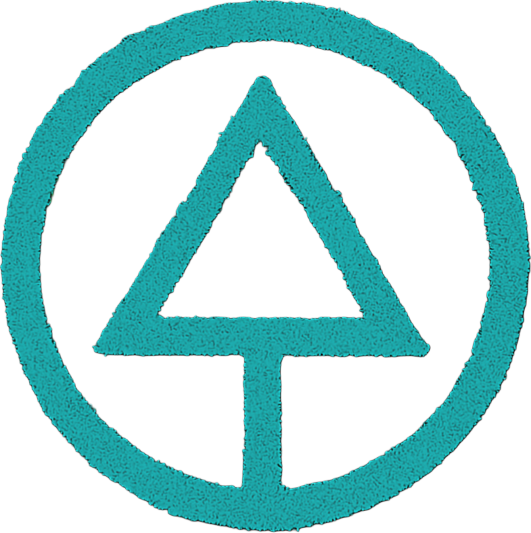
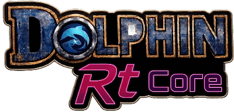
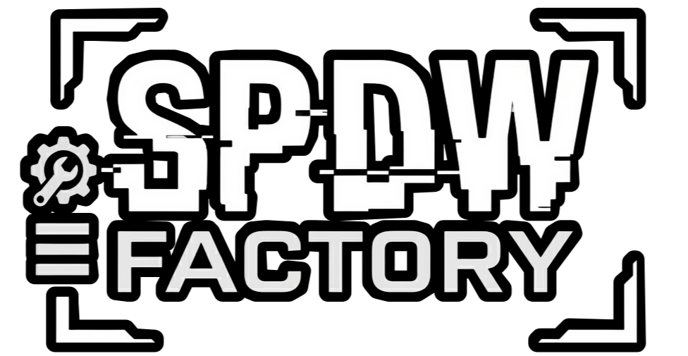
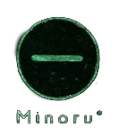

#  Dolphin Core for MuOS

**The definitive Dolphin Core optimization hub for muOS.**  
*A handheld running an ARM SoC deserves to squeeze every drop of performance out of GameCube and Wii.*

 

  

### 🗣️ [Join the Official Discussion on the muOS Forum](https://community.muos.dev/t/core-dolphin-for-muos-v9-take-3-by-speedrun/491)

> ℹ️ **IMPORTANT DISCLAIMER & COMMUNITY ACKNOWLEDGMENT**  
> This repository is **not** an original core built from scratch. Full credit for porting and pioneering GameCube/Wii emulation on muOS goes to the **original community developers**. This project represents a **fine-tuning, optimization, and repository management effort** built directly upon their foundation.

---

## 📜 Overview

Stock firmware gives you basic emulation and stops there. Thanks to **muOS**, fortunately, countless doors of possibility are thrown wide open. It provides an effective and highly functional environment that significantly elevates the quality of these portable consoles—often of dubious (or entirely unknown) origins—pushing them to heights we thought impossible for a 200g pocket-sized contraption. **Dolphin Core** is one of those peaks.

The goal of **Dolphin Core for MuOS** — now included as part of the **[V0iD Project]** by **SPDW Factory** — starts from a different premise: running GameCube and Wii on an **H700 chipset** requires surgical precision, relentless testing, and custom optimization profiles. We are actively working on this core with the specific aim of pushing the hardware to its absolute limits (and maybe a little beyond) to offer a genuinely pleasant and playable experience for the GameCube catalog and, albeit much more difficult, the Wii library.

---

## ⚙️ Key Features & Performance

### 🔧 General Optimizations
* **Strategic Underclocking:** Fine-tuning parameters like `Overclock = 0.4` to reduce virtual CPU load and prevent audio stuttering on the H700 chipset.
* **Adaptive Scaling:** Resolution adjustments and precise graphic flag management (`ImmediateXFBEnable`, `EFBToTextureEnable`) to maintain playable frame rates.
* **Visual Glitch Prevention:** Strict handling of `VISkip` to avoid breaking rendering engines on complex scenes.

### 📀 The Golden Tip: The Power of PAL ROMs
> 💡 **PRO TIP:** If you are struggling to squeeze every single frame out of your handheld, **always look for PAL ROMs**. Running natively at **50fps** (instead of 60fps NTSC) drastically reduces the processing load on the core, often making the difference between an unplayable slideshow and a remarkably smooth experience.

---

## 🗺️ Future Roadmap & Under Development

* 🧩 **Game Profiles:** Dedicated, unique configuration pairs (`dolphin.ini` and `gfx.ini`) tailored for specific target games (like *Super Mario Strikers* and *Luigi's Mansion*) to solve severe bottlenecks on a title-by-title basis.
* 🎮 **Hotkey Mapping:** Advanced secondary control layers via `gptokeyb` utilizing an **M** modifier key for instant system shortcuts without external peripherals.

---

## 💾 Legacy Notes & Core Info

Before **SPDW Factory** took over the optimization side, the foundation was laid by the original devs. Here are some critical legacy notes regarding the core itself you should be aware of:

* **Hardware Support:** **RG28XX is NOT supported**.
* **Exiting the Core:** To exit the core safely, use the Safe Reset Hotkey: press **`L1 + L2 + R1 + R2`** + **hold Power for 2 seconds**. *(Note: muOS standard hotkeys may also apply depending on your firmware version).*
* **Controller Logic (`gcpadnew.ini`):**
  * **V6:** For systems with no joysticks, the D-Pad defaults to the Main Stick.
  * **V6:** For systems with no joysticks, use **`L2` + D-Pad direction** for standard D-Pad actions.
  * **V8:** **`L2` + `A/B/X/Y`** mapped for C-Stick functionality.
* **Consolidated Build:** V9 consolidated the core into a single version for all devices, treating controller capabilities based on the device's built-in hardware (it will not account for a device with 0 or 1 joysticks connected to an external controller with 2 joysticks).

> *Looking for ancient artifacts? Check out the [Core History Archive](Core_History/) to browse legacy builds (V7, V8, V9) and read up on their evolution.*

---

## 📥 Installation Guide

1. **Download the Release:** Fetch the latest package file (`.muxupd`) from the **[Releases](#)** section.
2. **Transfer to Device:** Place the downloaded file into the `ARCHIVE` folder on either **`SD1`** or **`SD2`**.
3. **Open Archive Manager:** On your console, navigate to **Applications** ➔ **Archive Manager** inside muOS.
4. **Execute Install:** Select the downloaded file and launch the installation process.

---

## 📖 Usage Guide

1. **Navigate to Content:** Open **Content Explorer** from the main muOS menu.
2. **Locate Your Games:** Browse to the directory where you stored your Nintendo GameCube or Nintendo Wii ROMs.
3. **Assign Core Profile:** Match the game (or folder) with one of the available Dolphin core profiles.
4. **Launch & Play:** Boot up the title and test the performance!

> ⚠️ **IMPORTANT NOTE ON EXITING THE EMULATOR:**  
> Dedicated in-core hotkeys to directly exit Dolphin are not fully operational yet. To exit safely without risking filesystem corruption, use the native muOS safe restart shortcut:  
> 👉 **`L2` + `R2` + `SELECT`** (**Safe Console Reboot**).

---

## 📊 Compatibility List & Database

A brand new, interactive compatibility database is now live! It gathers and organizes all test results performed across previous core versions into a detailed, searchable format complete with user ratings and performance metrics:

* 🌐 **[Dolphin Core for muOS Interactive List](https://silvercrow2323.github.io/Dolphin-Core-for-MuOS/)**

Want to contribute to the chaos? If you test other titles, feel free to share your results by opening a new issue using our dedicated GameCube and Wii Test Templates.

> *Data history note: All preliminary data has been meticulously extrapolated and ported over from the [Original Community Google Sheets Spreadsheet](https://docs.google.com/spreadsheets/u/0/d/1LHXQV78yAuvii8J77KUgEt3Ap6TagjQzN48gdB9iVKY/htmlview).*

---

## 🤝 Credits & Acknowledgments

Part of the **SPDW Factory** ecosystem, created by **Sir Pips**.

  
    
  

 

This project stands upon the shoulders of the talented developers and community pioneers who made GameCube emulation on H700 handhelds a reality — as initially explored and documented in the official [muOS Community Discussion for Dolphin V9](https://community.muos.dev/t/core-dolphin-for-muos-v9-take-3-by-speedrun/491):

* **@Speedrun:** Original author of the Dolphin port for muOS (V9 / Take 3).
* **@FireBattleInMtl:** Huge thanks for all changes after V8, fixing permissions, and creating the script to add Dolphin to muOS' `launch.sh`.
* **@Snow:** For providing the newly compiled Dolphin binary file.
* **@bitter_bizarro:** For adopting the core and making it compatible with muOS Goose!
* **muOS Development Team:** For ongoing firmware maintenance and structural support.

---

  
   
  *continua a smontare le cose.*

