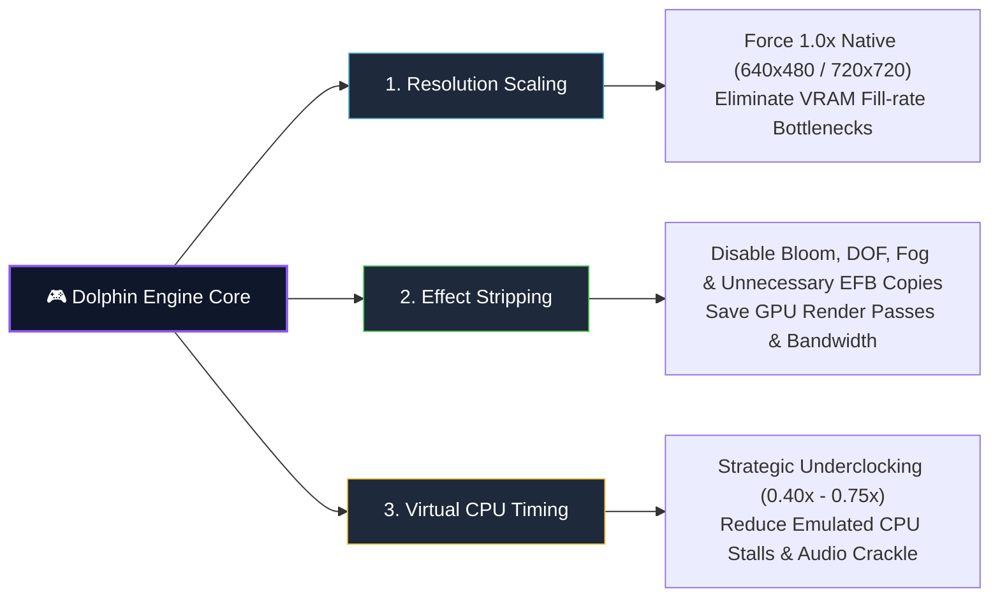
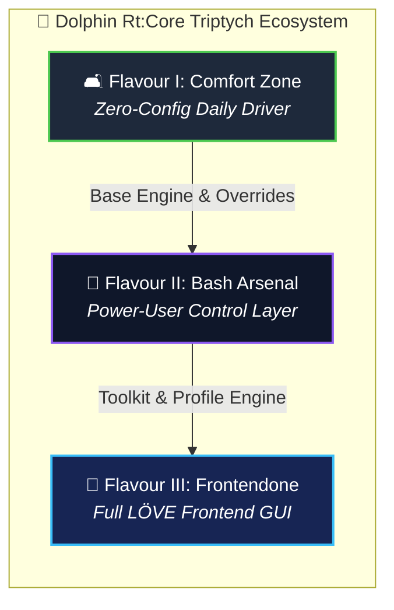

<div align="center">
  <h1>Dolphin Rt:Core for muOS</h1>
  <h3><b><i>The Triptych — One Emulator. Three Flavours. Sbrobs.</i></b></h3>
  <p><b>Surgically tuned GameCube &amp; Wii emulation for the Allwinner H700 chipset under muOS.</b></p>

  <p>
    <a href="https://github.com/SilverCrow2323/Dolphin-Core-for-MuOS/releases/latest">
      
    </a>
    
    
    
    
  </p>
</div>

---

> ### ⚡ **TL;DR — <u>Straight to the Point</u>**
> ***Stock firmware gives you emulation and calls it a day. muOS tears the door off the hinges. Dolphin Rt:Core is what happens next.***
>
> Running GameCube and Wii titles on an **Allwinner H700** is not a "plug-and-play" scenario. It is a surgical engineering task. It means negotiating with a strict $1\text{ GB}$ RAM budget, shaving off shader steps, stripping post-processing bloom, disabling depth-of-field passes, and coaxing stable $50\text{--}60\text{ FPS}$ output from titles that had no theoretical business booting on this hardware.
>
> This repository represents **the argument, won.** Three distinct flavours, one core philosophy: **squeeze every drop of performance out of the Mecha-Dolphin.**

---

## 🧠 <u>The Hardware Reality & Architectural Levers</u>

Before deploying profiles, it is critical to evaluate the system boundaries of our target hardware:

| Component | Hardware Specification | Operational Reality |
| :--- | :--- | :--- |
| **SoC** | Allwinner H700 ($4\times \text{Cortex-A53} \text{ @ } 1.5\text{ GHz}$) | *Entry-level baseline for GC/Wii instruction set recompilation* |
| **GPU** | Mali-G31 MP2 (Bifrost Architecture) | *Bandwidth-constrained mobile GPU; heavy geometry/post-processing bottlenecks* |
| **RAM** | $1\text{ GB}$ LPDDR4 (Shared pool) | *Unified system/video memory; zero headroom for memory leaks* |
| **Display** | $640\times 480$ (RG35XX-H) $\rightarrow$ $720\times 720$ (RG CubeXX) | *Strict internal resolution multiplier of $1.0\times$ (Native)* |
| **Storage** | MicroSD (I/O throughput bound) | *Lossless compressed RVZ container format mandatory* |

To push past native performance ceilings, **Dolphin Rt:Core** operates on **three primary tuning levers**:


```mermaid
graph LR
    A[🎮 Dolphin Engine Core] --> B[1. Resolution Scaling]
    A --> C[2. Effect Stripping]
    A --> D[3. Virtual CPU Timing]

    B --> B1["Force 1.0x Native (640x480 / 720x720)<br>Eliminate VRAM Fill-rate Bottlenecks"]
    C --> C1["Disable Bloom, DOF, Fog & Unnecessary EFB Copies<br>Save GPU Render Passes & Bandwidth"]
    D --> D1["Strategic Underclocking (0.40x - 0.75x)<br>Reduce Emulated CPU Stalls & Audio Crackle"]

    style A fill:#0f172a,stroke:#8c59f2,stroke-width:2px,color:#fff
    style B fill:#1e293b,stroke:#4fa8c7,stroke-width:1px,color:#fff
    style C fill:#1e293b,stroke:#4cc850,stroke-width:1px,color:#fff
    style D fill:#1e293b,stroke:#f5c542,stroke-width:1px,color:#fff
```

### ⚠️ <u>Realistic Expectation Limits</u>

Even with maximum architectural tuning, the physical limits of the ARM Cortex-A53 silicon remain fixed:

* 🟢 **Lightweight 2D & 3D Games:** $30 \text{ -- } 50\text{ FPS}$ *(Fully Playable)*
* 🟡 **Medium 3D Games:** $15 \text{ -- } 25\text{ FPS}$ *(Fair / Enjoyable with Speedhacks)*
* 🔴 **Heavy 3D Games:** $5 \text{ -- } 15\text{ FPS}$ *(Technical Benchmark / Edge Cases)*

> [!IMPORTANT]
> Overclocking physical hardware increases thermal output and power drain without addressing emulated timing desyncs. The profiles in this repository rely on **strategic virtual CPU underclocking**, decreasing emulated cycle loads to maintain target frame rates without overheating the physical device.

---

## ⚙️ <u>Base Engine Parameters — H700 Profile Calibration</u>

Every edition of Dolphin Rt:Core shares a calibrated internal configuration layer tuned specifically for Mali-G31 graphics and ARM64 architecture.

### 🧩 `Dolphin.ini` — Core Architecture Calibration

| Configuration Key | Global Value | Engineering Justification |
| :--- | :---: | :--- |
| `CPUCore` | `4` | Forces **JITARM64** recompiler ($\Delta_{\text{FPS}} \approx +50\% \text{ to } +300\%$ over interpreter). |
| `CPUThread` | `True` | Separates emulated CPU processing onto a distinct thread. |
| `EnableIdleSkipping` | `True` | Dynamically skips CPU idle loops. Critical performance gain for spin-wait cycles. |
| `SyncGPU` | `False` / `True` | `False` in performance profiles; `True` in compatibility mode to prevent rendering desyncs. |
| `Overclock` | `0.40` – `1.00` | Strategic *virtual underclocking* to reduce physical cycle demands on weak CPUs. |
| `TimingVariance` | `40` – `60` | Relaxes audio buffer deadlines to suppress frame stall pops and crackles. |
| `FastDiscSpeed` | `True` | Bypasses emulated DVD optical drive latency. |
| `Framelimit` | `1` | Auto-caps execution rate to standard refresh rates ($50\text{ Hz} / 60\text{ Hz}$). |
| `SkipIPL` | `True` | Skips GameCube boot animation, reducing boot time to cold gameplay. |

### 🎨 `GFX.ini` — Pipeline & Graphics Engine Calibration

| Configuration Key | Global Value | Engineering Justification |
| :--- | :---: | :--- |
| `Backend` | `Vulkan` | Bypasses high GLES overhead; direct low-level GPU pipeline control on Mali. |
| `InternalResolution` | `1` | Locked to $1.0\times$ native rendering. Higher scaling overwhelms VRAM bandwidth. |
| `ShaderCompilationMode` | `3` | **Asynchronous (Ubershaders / Skip on Render)** prevents shader compile stutter. |
| `DisableFog` | `True` / `False` | Removes fog depth calculations in performance profiles for free fill-rate gains. |
| `FastDepthResult` | `True` | Accelerates z-buffer processing. |
| `EFBToTextureEnable` | `True` | Redirects Embedded Frame Buffer copies to VRAM texture cache rather than system RAM. |
| `SkipEFBCopyToRam` | `True` | Prevents slow CPU RAM sync operations ($\Delta_{\text{FPS}} \approx +10 \text{ to } +20\%$). |
| `DeferEFBCopies` | `True` | Batches frame updates to synchronize GPU draw calls efficiently. |
| `XFBToTextureEnable` | `True` | External Frame Buffer processed directly in texture memory. |
| `FastTextureSampling` | `True` | Simplifies texture filter passes to conserve Mali GPU cycles. |
| `SafeTextureCacheColorSamples` | `0` | Disables redundant color sampling verification; maximum execution speed. |
| `EnableGraphicsMods` | `True` | Enables runtime parsing of custom graphics mod injections (`GraphicMods/`). |

---

## 🔱 <u>The Triptych — Architecture Overview</u>

Dolphin Rt:Core is delivered across **three independent, specialized flavours**. Choose the exact operational model that fits your preferred workflow:


```mermaid
graph TD
    subgraph Ecosystem ["🐬 Dolphin Rt:Core Triptych Ecosystem"]
        direction TB
        F1["🛋️ Flavour I: Comfort Zone<br><i>Zero-Config Daily Driver</i>"]
        F2["🔧 Flavour II: Bash Arsenal<br><i>Power-User Control Layer</i>"]
        F3["🎨 Flavour III: Frontendone<br><i>Full LÖVE Frontend GUI</i>"]
    end

    F1 -->|Base Engine & Overrides| F2
    F2 -->|Toolkit & Profile Engine| F3

    style F1 fill:#1e293b,stroke:#4cc850,stroke-width:2px,color:#fff
    style F2 fill:#0f172a,stroke:#8c59f2,stroke-width:2px,color:#fff
    style F3 fill:#172554,stroke:#38bdf8,stroke-width:2px,color:#fff
```

---

### 🛋️ <u>Flavour I: Comfort Zone — Zero-Config Daily Driver</u>

<div align="center">
  
  
  <h3>🛋️ Flavour I: Comfort Zone</h3>
  <p><b><i>Only straight gaming sessions, zero setting nightmares.</i></b></p>
</div>

**Comfort Zone** is engineered for players who want a pure, zero-friction handheld experience. Assign a profile core, launch your ROM, and enjoy pre-tuned gameplay.

* 🚀 **7 Battle-Tested Profiles:** `performance`, `compatibility`, `rintromping`, `speedhacks`, `blackscreenfix`, `sweetspot`, and `default` (available for GameCube & Wii upright/sideways).
* 🌸 **Global Bloom Removal:** Post-processing bloom blur is stripped engine-wide, granting an instant **$+2 \text{ to } +5 \text{ FPS}$** boost across heavy 3D titles.
* 🏎️ **Crash Nitro Kart HD Texture Pack:** Includes a compact $5.7\text{ MB}$ replacement pack fixing the notorious C4 texture tiling artifacts on UI elements and HUD icons.
* 🎯 **Targeted DOF Removal:** 10 heavy titles (including *Super Mario Sunshine*, *Metroid Prime*, and *Crash Bandicoot*) automatically disable depth-of-field blur.
* ⚙️️ **12 Hand-Tuned GameSettings Overrides:** Hardcoded per-game underclocks and EFB/XFB fixes pre-configured for instant stability.
* 🚪 **Native Shutdown Hotkey:** Pressing <kbd>START</kbd> + <kbd>SELECT</kbd> sends a clean native `SIGTERM` directly to Dolphin, ensuring safe memory card saves.

📖 **[Read the complete Flavour I: Comfort Zone Documentation →](README.md)**

---

### 🔧 <u>Flavour II: Bash Arsenal — Power-User Control Layer</u>

<div align="center">
  
  
  <h3>🔧 Flavour II: Bash Arsenal</h3>
  <p><b><i>Full control. Zero hand-holding.</i></b></p>
</div>

**Bash Arsenal** is an administrative extension layered directly on top of Comfort Zone. It preserves all base stability while embedding the **muOS Task Toolkit system** for on-device live tuning.

* 🎚️ **Granular Tier System:** Extends core profiles into 3 discrete execution tiers: **`Lite`** (minimal hacks), **`Std`** (balanced), and **`Max`** (aggressive speedhacks).
* 🧰 **Task Toolkit Integration:** Over 30 shell automation scripts arranged across 7 task categories:
  1. *Profile Adjusters*
  2. *Toggles (Bloom / DOF / Fog / Audio)*
  3. *Config Management*
  4. *Advanced Options (Dynamic Mod Scanner)*
  5. *System Diagnostics & Logs*
  6. *Technical Manual Reader*
  7. *Save Data Utilities*
* 🔍 **Dynamic Graphic Mod Scanner:** Automatically indexes `/GraphicMods/`, `/Textures/`, and `/Riivolution/` directories and builds dynamic toggle interfaces.
* 📖 **On-Device Interactive Manual:** A 13-page technical manual viewable directly on the handheld screen.
* 🌐 **Dual Core Assignment Modes:** Toggle between *Clean Standard Core Assignment* or *Exposed Tier Assignment* (allowing distinct tier choices per directory).

📖 **[Read the complete Flavour II: Bash Arsenal Documentation →](02_RtCore_BashArsenal/README.md)**

---

### 🎨 <u>Flavour III: Frontendone — The Full Frontend Experience</u>

<div align="center">
  
  
  <h3>🎨 Flavour III: Frontendone</h3>
  <p><b><i>The full frontend. A console within a console.</i></b></p>
  <p></p>
</div>

**Frontendone** turns Dolphin Rt:Core into a standalone graphical application running via the LÖVE 2D framework on muOS. It provides a full console interface with game art, profiles, and workshop tools.

* 🎮 **Interactive Media Library:** Browse, filter, search, and launch GameCube and Wii titles with box art cover rendering.
* 🔄 **3D Dashboard Rotation:** Seamlessly swap between the **GameCube Dashboard** and the **Wii Dashboard** using <kbd>SELECT</kbd>, updating system graphics, ambient audio, and controller layout contexts in real time.
* 🛠️ **Built-in Workshop:** Create, test, and apply custom profile configurations, graphics mods, and controller mappings without touching command-line tools.
* 📊 **Live Compatibility Guide:** An on-device database detailing tested game configurations, expected FPS, and recommended core profile assignments.

📖 **[Read the Flavour III: Frontendone Roadmap →](03_RtCore_Frontendone/)**

---

## 💡 <u>Optimization Tips & Format Standards</u>

### 📺 1. Standardize on PAL Region ROMs ($50\text{ Hz}$)

When selecting game releases, prioritize **PAL (European)** regions over NTSC (North American / Japanese) versions where available:

$$\text{NTSC Output Requirement} = 60\text{ FPS} \quad (16.67\text{ ms / frame})$$
$$\text{PAL Output Requirement} = 50\text{ FPS} \quad (20.00\text{ ms / frame})$$

$$\text{Frame Workload Reduction} = \frac{60 - 50}{60} \approx 16.67\%$$

A $16.67\%$ reduction in per-second frame render requirements is often the exact threshold needed to move a title from audio stuttering into smooth execution on the H700 chipset.

---

### 📦 2. Convert ISO Assets to Lossless RVZ Format

Uncompressed `.iso` and `.gcm` files waste storage capacity and impair MicroSD read latency. **RVZ (Dolphin Native Compressed Format)** offers superior compression ratios and optimized block decompression performance.

#### Standard Conversion Command Line:
```bash
dolphin-tool convert -i "input_game.iso" -o "output_game.rvz" -f rvz -b 131072 -c zstd -l 5
```

#### Recommended Parameters for Allwinner H700:

| Flag | Parameter | Operational Impact |
| :---: | :---: | :--- |
| `-f` | `rvz` | Specifies Dolphin native RVZ container format. |
| `-b` | `131072` | Sets block size to **$128\text{ KiB}$**, matching handheld CPU cache characteristics. |
| `-c` | `zstd` | Enables **Zstandard** compression for high throughput decompression. |
| `-l` | `5` | **Compression Level 5** — Optimal balance between file size and CPU decompression overhead. |

> [!WARNING]
> Do not compress files using level 9 (`-l 9`) or LZMA compression. High compression levels increase real-time CPU decompression overhead, causing micro-stutters during game asset streaming.

---

### 🎯 3. Per-Game Override Tuning (`GameSettings`)

To apply game-specific parameters without affecting global core profile defaults, create a specific override file in `/share/emulator/dolphin/GameSettings/<GAMEID>.ini`.

Example (`GMSP01.ini` — *Super Mario Sunshine*):
```ini
[Core]
Overclock = 0.600000
OverclockEnable = True

[GFX]
EFBAccessEnable = True
SafeTextureCacheColorSamples = 512
```

---

## 📂 <u>System Directory Structures</u>

### ⚙️ Main Core Architecture (`/opt/muos/`)

```text
/opt/
└── muos/
    ├── script/
    │   └── launch/
    │       └── ext-dolphinrt.sh            # 📜 Main launcher wrapper script
    └── share/
        ├── emulator/
        │   └── dolphin/
        │       ├── Config/                 # ⚙️ Active INI execution files
        │       │   ├── Dolphin.ini
        │       │   ├── GFX.ini
        │       │   ├── GCPadNew.ini
        │       │   └── WiimoteNew.ini
        │       ├── GameSettings/           # 🎯 12+ Per-game engine overrides
        │       ├── Load/
        │       │   ├── GraphicMods/        # 🎨 Bloom removal & DOF patches
        │       │   └── Textures/           # 🏎️ Crash Nitro Kart HD texture pack
        │       ├── RtSys/                  # 🛠️ System exit watchers & uninstallers
        │       │   ├── overlay_exit.sh
        │       │   ├── uninstall_dolphinrt.sh
        │       │   └── logs/               # 📝 Capped diagnostic log files (2 max)
        │       ├── Sys/                    # 🧬 System BIOS fonts & shaders
        │       │   └── GC/                 # GameCube IPL western/jp fonts
        │       └── Wii/                    # 🎮 Emulated Wii NAND structure
        └── info/
            └── assign/                     # 🧩 Core profile assignment mappings
                ├── Nintendo Gamecube/
                └── Nintendo Wii/
```

### 🎨 Frontendone Standalone Architecture (Flavour III)

```text
/run/muos/storage/application/DolphinRtUI/
├── frontend/
│   ├── assets/          # Fonts, visual sprites, audio assets
│   ├── conf/            # gptokeyb2 input mapping configs
│   ├── data/            # settings.json, games_database.json, cached artwork
│   ├── dolphin-emu/     # Bundled standalone Dolphin binary build
│   ├── screens/         # LÖVE view interfaces (Library, Profiles, Manual)
│   ├── scripts/         # Engine launch hooks & ROM scanner automation
│   └── workshop/        # Custom profile templates & cheat code databases
├── glyph/               # Application icon
├── lib/                 # LÖVE 2D runtime, LuaJIT binaries, gptokeyb2
├── mux_launch.sh        # Application entry launcher
└── test_launch.sh       # Terminal debugging suite
```

---

## 📊 <u>Compatibility Reference Database</u>

An official benchmark database covering over **200+ tested GameCube and Wii titles** — complete with performance ratings, expected FPS metrics, and recommended profile core assignments — is maintained online:

🌐 **[Dolphin Rt:Core for muOS — Official Compatibility Matrix](https://silvercrow2323.github.io/Dolphin-Core-for-MuOS/)**

To submit benchmark metrics for new titles, open a report using the **[Community Test Report Template](https://github.com/SilverCrow2323/Dolphin-Core-for-MuOS/issues/new?template=dolphin-rt-core-test-report.yml)**.

---

## 🙏 <u>Credits & Community Acknowledgments</u>

<div align="center">
  
  <br>
  <b>sirpips aka SilverCrow2323</b>
  <br>
  <i>SPDW Factory Lab Lead Maintainer</i>
</div>

<br>

> [!NOTE]
> **Community Acknowledgment & Disclaimer:**  
> This project represents a fine-tuning, architectural optimization, and system integration effort built on top of upstream core developments. Full credit for pioneering initial Dolphin core compilation and porting efforts on muOS belongs to the original community developers.

### 🐬 Core Development & Porting History

| Contributor / Developer | Key Architectural Contribution |
| :--- | :--- |
| **@Speedrun** ([Speedrun [+.[🐬].%]](https://community.muos.dev/u/speedrun)) | Original author of the initial Dolphin core port for muOS (V9 / Take 3 baseline). |
| **@FireBattleInMtl** ([@FireBattleInMtl](https://community.muos.dev/u/firebattleinmtl)) | Port maintenance, execution permission hardening, and `launch.sh` ecosystem integration. |
| **@Snow** (SnowV8) | Compilation and optimization of standalone Dolphin binary releases. |
| **@bitter_bizarro** | Core adoption and system compatibility updates for muOS Goose release standards. |
| **Testing & Verification Team** | **@razorbeamz**, **@arkun**, **@SkiffguardLando**, **@chronoss0109**, **@Kirky**, **@Mikethe3ird**, **@Symphonial**, **@giodude**, **@lasagnesetting**, **@joshuarcastillo** |

---

## 🔗 <u>Links & Project Resources</u>

* 🌐 **[GitHub Repository](https://github.com/SilverCrow2323/Dolphin-Core-for-MuOS)**
* 📦 **[Latest Releases](https://github.com/SilverCrow2323/Dolphin-Core-for-MuOS/releases/latest)**
* 📊 **[Compatibility Database](https://silvercrow2323.github.io/Dolphin-Core-for-MuOS/)**
* 💾 **[Official muOS Documentation](https://muos.dev)**
* 🐬 **[Dolphin Emulator Project](https://dolphin-emu.org)**

---

<div align="center">
  
  
  <br><br>
  <b>Dolphin Rt:Core for muOS — Triptych Edition</b><br>
  <b><u>Still Sbrobbing. Always Rintromping.</u></b> 🎮
</div>
